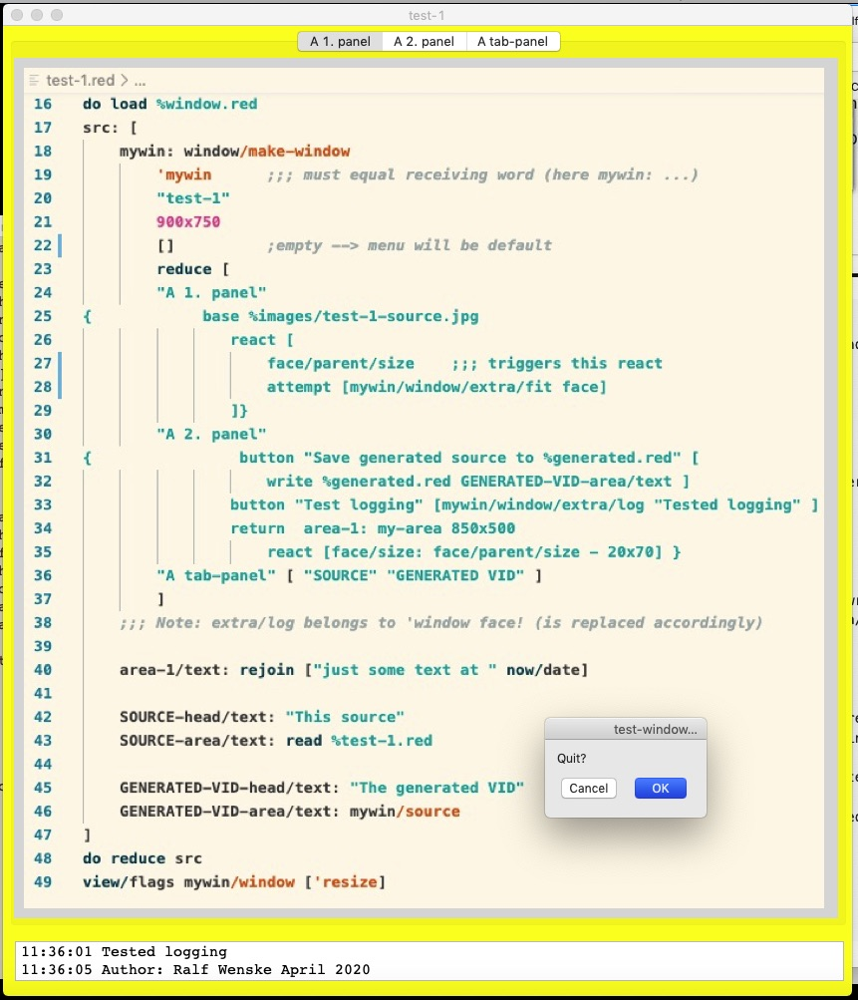
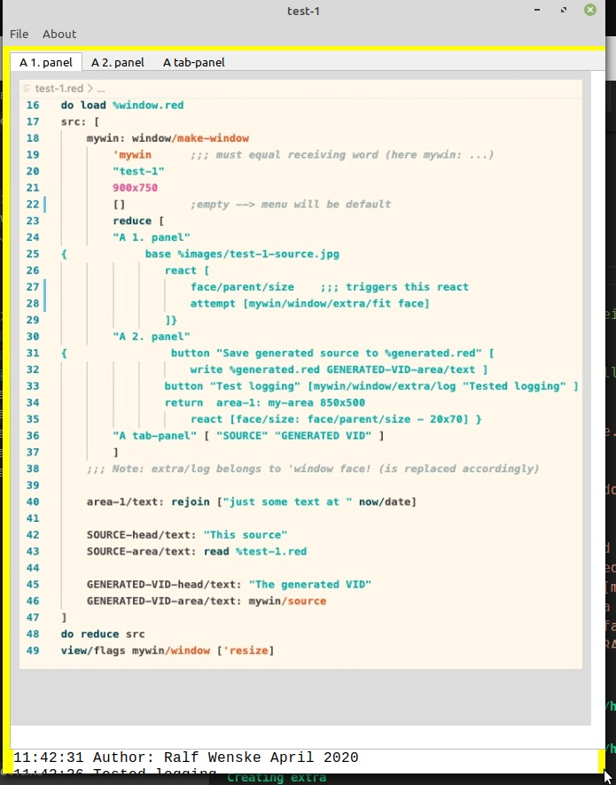

## window
 
 window/make-window creates a resizable view with tab-panels and areas.

 It is grown out of the need to be able to quickly present data without spending much time with the details of VID. 

 Here the running app %test-1.red showing it's own source code.
 

The same run on Linux Mint GTK branch - (alignments need to be refined).

 

```
Red []
git: https://raw.githubusercontent.com/ralfwenske/window/master/ 
pull: function [f [file!] /bin][ 
    unless exists? f [
        unless exists? p: first split-path f [make-dir p]
        either bin [
            save f load rejoin [git f]
        ][
            write f read rejoin [git f]
        ] 
    ]
]
pull %window.red 
pull %test-1.red 
pull/bin %images/test-1-source.jpg
do load %window.red
src: [
    mywin: window/make-window  
        'mywin      ;;; must equal receiving word (here mywin: ...)
        "test-1"
        900x750 
        []          ;empty --> menu will be default
        reduce [
        "A 1. panel" 
{            base %images/test-1-source.jpg
                react [
                    face/parent/size    ;;; triggers this react
                    attempt [mywin/window/extra/fit face] 
                ]}
        "A 2. panel"  
{                button "Save generated source to %generated.red" [
                    write %generated.red GENERATED-VID-area/text ]
                button "Test logging" [mywin/window/extra/log "Tested logging" ]
                return  area-1: my-area 850x500
                    react [face/size: face/parent/size - 20x70] } 
        "A tab-panel" [ "SOURCE" "GENERATED VID" ]
        ]        
    ;;; Note: extra/log belongs to 'window face! (is replaced accordingly)

    area-1/text: rejoin ["just some text at " now/date]

    SOURCE-head/text: "This source"
    SOURCE-area/text: read %test-1.red

    GENERATED-VID-head/text: "The generated VID"
    GENERATED-VID-area/text: mywin/source    
]
do reduce src
view/flags mywin/window ['resize]
```

%test-2.red shows a bit more involvement:
* the menu is user defined
* preloading of areas
* loading of areas triggered by button clicks

The generated code can be saved to a file which should show the view
(you may have to deactivate some actors - it is just the VID layout )


Note:
    When playing with these tests or your own you may find a few little things that still need to be resolved - eg.
        on macOS: text wrapping
        on GTK: alignment issues, text wrapping
            Hitting 'Cancel' on dialog shuts the app down (when activated clicking X)
    
    The code probably has much room for improvement and I welcome suggestions.
    And `window/make-window` 